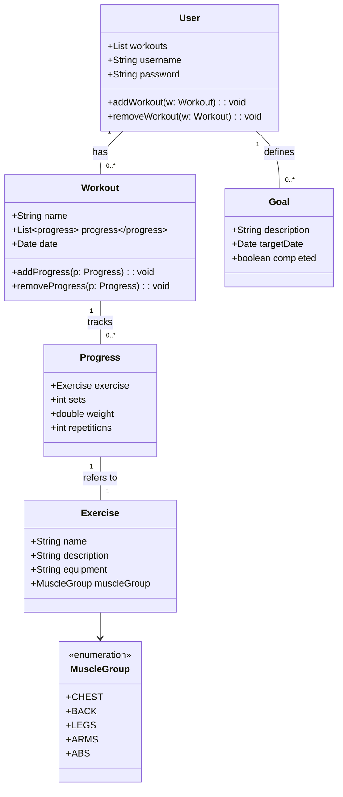

# Meu Projeto de Aplicativo de Treino

Estou desenvolvendo um aplicativo para gerenciar e otimizar meus treinos na academia. Este aplicativo tem como objetivo proporcionar uma experiência personalizada e eficiente para o acompanhamento e planejamento dos exercícios, com funcionalidades que incluem:

Gerenciamento de Exercícios: Cadastro e organização de diferentes exercícios, incluindo detalhes como grupos musculares trabalhados, repetições e séries.
Planos de Treino: Criação e personalização de planos de treino com base nas metas individuais.

